# SecureBid User Manual

Welcome to SecureBid. This guide takes a brand-new user from "never opened
the app" to fluent, screen by screen, for whichever of its three portals
you use. No prior knowledge of the codebase is needed to follow it.

## Contents

1. [What SecureBid is](#1-what-securebid-is)
2. [Getting started](#2-getting-started)
3. [How to navigate the app](#3-how-to-navigate-the-app)
4. [For Bidders / Contractors](#4-for-bidders--contractors)
5. [For Tender Callers](#5-for-tender-callers-buyer--procuring-entity)
6. [For Government Officials](#6-for-government-officials)
7. [Account & security](#7-account--security)
8. [Glossary](#8-glossary)
9. [Troubleshooting](#9-troubleshooting-running-it-yourself)

---

## 1. What SecureBid is

SecureBid is a procurement platform for Indian public tenders that serves
**three independent kinds of user** from one application, each with their
own sign-in page, their own navigation, and even their own colour identity
so you always know which portal you're in at a glance:

| Role | Colour | Who this is | Sign in at |
|---|---|---|---|
| **Bidder / Contractor** | Blue | A company that bids on public tenders | `/login` |
| **Tender Caller** | Teal | A government department or PSU publishing tenders | `/login/buyer` |
| **Government Official** | Violet | Cross-department oversight, read-only | `/login/official` |

If you're unsure which one is you: if you're going to **bid on** tenders,
you're a Bidder. If you're going to **publish** tenders and pick a winner,
you're a Tender Caller. If you're auditing the system without bidding or
publishing anything yourself, you're a Government Official.

Each portal is built around one differentiator:

- The **Bidder** portal centres on an auction-theoretic pricing engine —
  not just "here are some tenders" but "here's what to bid, and why."
- The **Tender Caller** portal centres on a clean publish-and-award
  workflow that feeds real activity back into the bidder-side statistics.
- The **Government Official** portal centres on an **anomaly-detection
  system** — OECD-style statistical screens for bid-rigging patterns,
  surfaced as a risk-ranked, explainable, non-accusatory tool for deciding
  where oversight attention is worth spending.

---

## 2. Getting started

### 2.1 The splash screen

The first time you open the app in a browser session, the SecureBid logo
plays for about three seconds before the sign-in page appears. This is a
one-time intro per browser session — closing and reopening a tab, or
following a bookmarked or shared link, goes straight to the content instead
of repeating the animation. This matters in practice: a link someone shares
to a specific tender, or a password-reset email, should open immediately
rather than force a three-second wait every time.

### 2.2 Choosing your portal and signing in

Each portal's sign-in page carries its own colour, its own short
description of what that role does, and a small pill switcher at the
bottom so you can jump to a different portal if you picked the wrong one
without re-typing a URL.

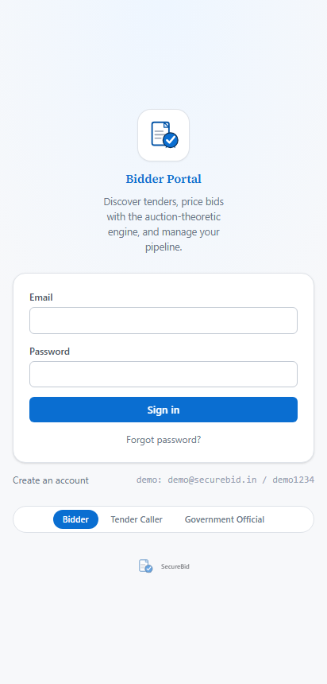

*The Bidder sign-in page. Note the blue accent, the role switcher pill row
at the bottom, and the demo credentials printed for convenience.*

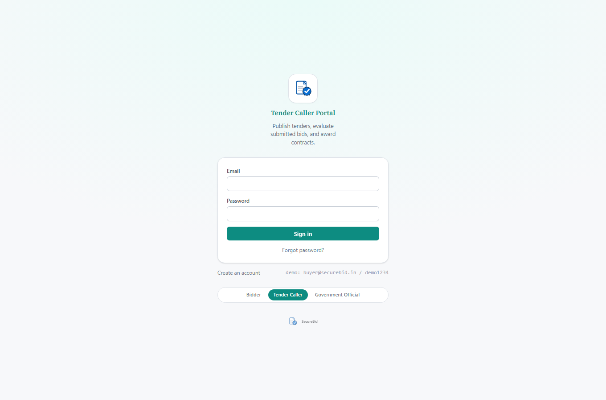

*The Tender Caller portal — same layout, teal accent, different copy
describing what a buyer account can do.*

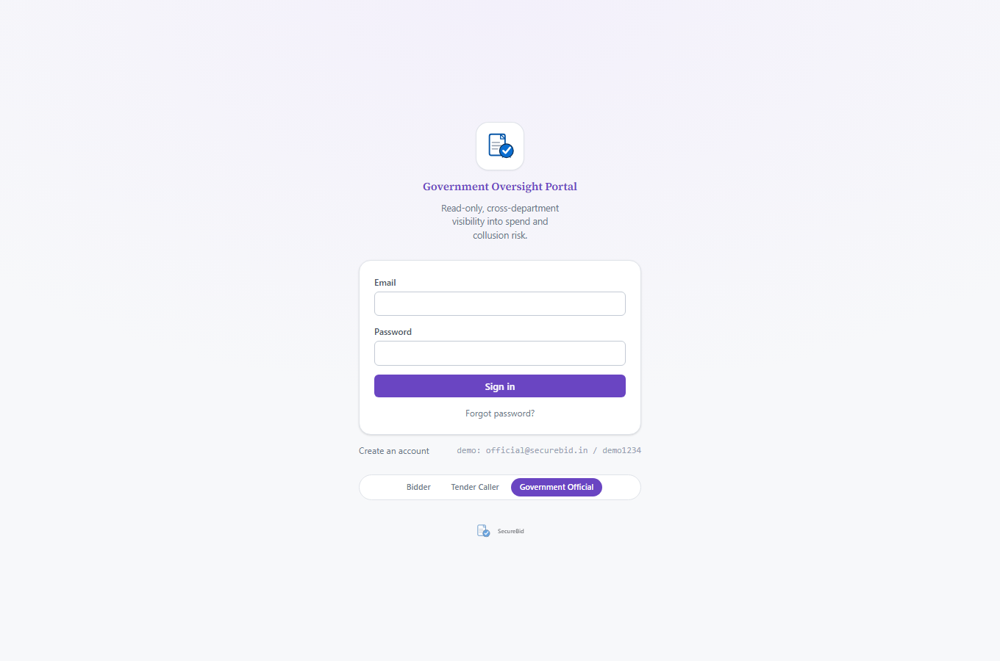

*The Government Official portal — violet accent, and copy that makes clear
this is a read-only oversight role.*

To try the app immediately without creating an account, use the demo
credentials printed on every sign-in page:

| Role | Email | Password |
|---|---|---|
| Bidder | `demo@securebid.in` | `demo1234` |
| Tender Caller | `buyer@securebid.in` | `demo1234` |
| Government Official | `official@securebid.in` | `demo1234` |

### 2.3 Signing in with a personal account (email/password) or Google

On the Bidder sign-in page you have two ways in:

- **Your own account** — an email and password, either one you registered
  yourself or the demo credentials above.
- **Continue with Google** — a real Google sign-in button (Google's own
  official widget, not a look-alike) appears automatically beneath the
  form whenever the server has Google sign-in configured. Click it, pick
  your Google account, and SecureBid verifies the credential directly with
  Google's servers before creating or signing you into a bidder account —
  there is no password to remember for this path. The very first time you
  use it, SecureBid creates a bidder account for you automatically, using
  the name and (already-verified) email Google reports.

If you don't see the Google button, it means whoever is running this
SecureBid instance hasn't configured it yet (it needs a Google Cloud OAuth
Client ID — see §9). Your personal email/password account always works
regardless.

Tender Caller and Government Official accounts are institutional, so they
only use email/password — Google sign-in is a Bidder-portal convenience.

### 2.4 Creating your own account

Click **Create an account** on any sign-in page.

- **Bidders** enter a company name, email and password. A basic company
  profile is created automatically; fill in the real details later from
  **Company Profile** (§4.11) — the richer your profile, the more accurate
  your eligibility screening and pricing recommendations will be.
- **Tender Callers** and **Government Officials** additionally enter a
  department and state, since those accounts represent an organisation
  rather than an individual bidder.

After registering you're signed in immediately and land on your portal's
home screen.

### 2.5 One session at a time

Signing in on a second tab or device automatically signs out any earlier
session for that account — SecureBid only keeps one active session per
account, on purpose. If you're suddenly signed out, it's because you (or
someone with your password) signed in elsewhere.

### 2.6 Verifying your email

New accounts start unverified (Google sign-in accounts are the exception —
Google has already verified that email, so those start verified). You'll
see a banner at the top of the app prompting you to verify; click **Resend
verification email** if needed. In a local/demo setup with no mail server
configured, the verification link is printed to the server's console log
instead of actually being emailed — look there if you're running this
yourself. Using the app doesn't require verification; it's a reminder, not
a lock.

### 2.7 Forgot your password?

On the sign-in page, click **Forgot password?**, enter your email, and
follow the same "check the server console for the link" process described
above in a local setup (a real deployment with SMTP configured emails it to
you instead). Resetting your password signs out every other session on
that account, as a security measure.

### 2.8 Signing out

Open the menu (see §3.2) and tap **Sign out**. This invalidates your
session token immediately on the server — it isn't just a local "forget
the password" action, so the token can't be reused even if someone captured
it beforehand.

---

## 3. How to navigate the app

SecureBid is deliberately built like a mobile app rather than a document
you scroll through, because a working professional tool should be operated
in short, targeted visits, not read top to bottom.

### 3.1 The bottom bar: four major features

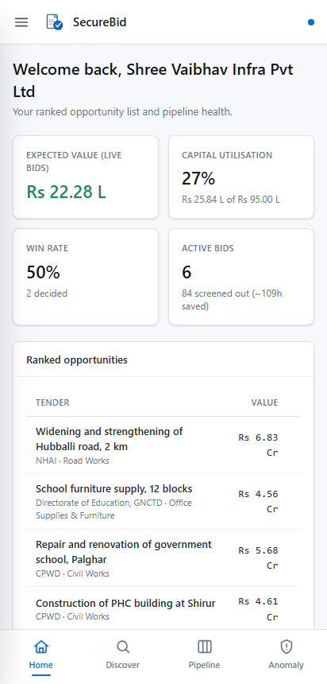

*The four things you'll reach for constantly, always one tap away, on every
screen. This example is the Bidder portal on a phone-width screen — the
same bar appears at desktop width too, just wider.*

Every portal keeps its four most-used features fixed at the bottom of the
screen, always visible, never buried in a scrolling list:

| Role | Bottom bar |
|---|---|
| Bidder | Home (Dashboard) · Discover · Pipeline · **Anomaly** |
| Tender Caller | Tenders (My Tenders) · Create · Awards · Profile |
| Government Official | Overview · Registry · **Anomaly** · Profile |

Tap any of the four at any time — you never need to go "back" to a home
screen first.

### 3.2 The menu: everything else

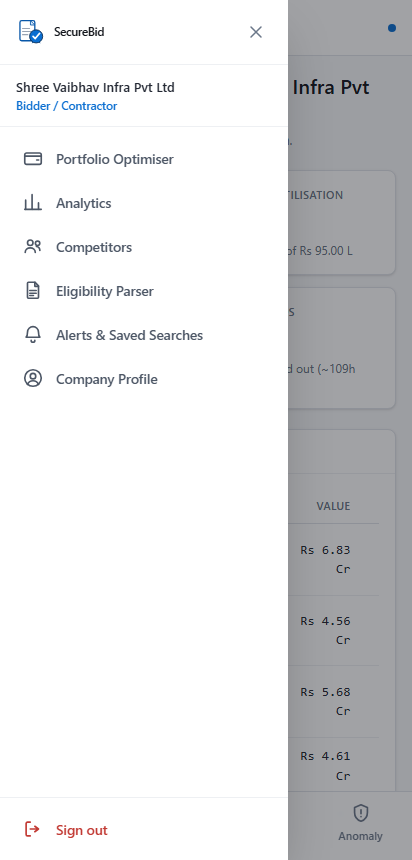

*Tap the hamburger icon (top-left, next to the logo) to slide this out.
Everything that isn't one of the four bottom-bar features lives here —
for a Bidder that's Portfolio, Analytics, Competitors, the Eligibility
Parser, Alerts & Saved Searches, and your Company Profile, plus Sign out
at the bottom.*

This is the deliberate fix for the old design's biggest complaint: instead
of ten-plus links stacked in one long sidebar you had to scroll through,
the four things you use every session sit permanently at the bottom, and
everything else is one tap away in a menu that gets out of the way when
you're not using it. Tender Callers and Government Officials, who each
only have four features total, don't need the menu for navigation at all —
for them it holds just the Sign out button.

### 3.3 Colour tells you where you are

The top bar's small dot, the active bottom-bar icon, the menu's role label,
and every primary button on the page all pick up your portal's colour
(blue for Bidder, teal for Tender Caller, violet for Government Official).
If you ever have two SecureBid tabs open in different roles, the colour is
the fastest way to tell them apart without reading anything.

---

## 4. For Bidders / Contractors

### 4.1 Dashboard (Home)

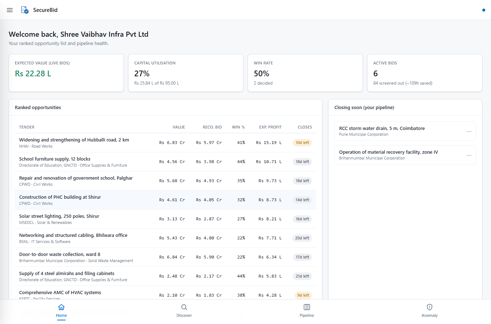

Your home screen. Four tiles summarise where you stand:

- **Expected value (live bids)** — the sum of expected profit across
  everything you've marked "submitted".
- **Capital utilisation** — how much of your working capital is currently
  locked up as EMD on submitted bids.
- **Win rate** — wins ÷ (wins + losses) among tenders you've fully decided.
- **Active bids** — how many tenders are currently in "preparing" or
  "submitted", plus how many tenders were automatically screened out as
  ineligible (and roughly how many hours that saved you from reading).

Below that, **Ranked opportunities** lists every open tender you're
eligible for, sorted by expected profit — tap any row to open it. **Closing
soon** on the right flags anything in your pipeline that still needs
attention before its deadline.

### 4.2 Discover

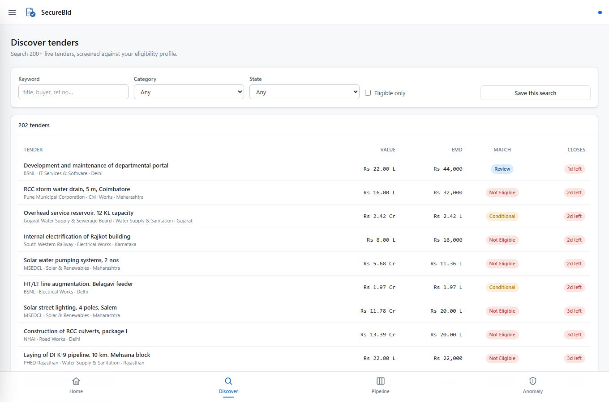

Search and filter the full list of live tenders by keyword, category,
state, or eligibility. Turn on **Eligible only** to hide anything your
company profile doesn't qualify for. Click **Save this search** to turn
your current filters into a saved search (§4.10) you can re-run or get
alerted on later. Tap any row to open the tender's detail page.

### 4.3 Tender detail — the pricing recommendation

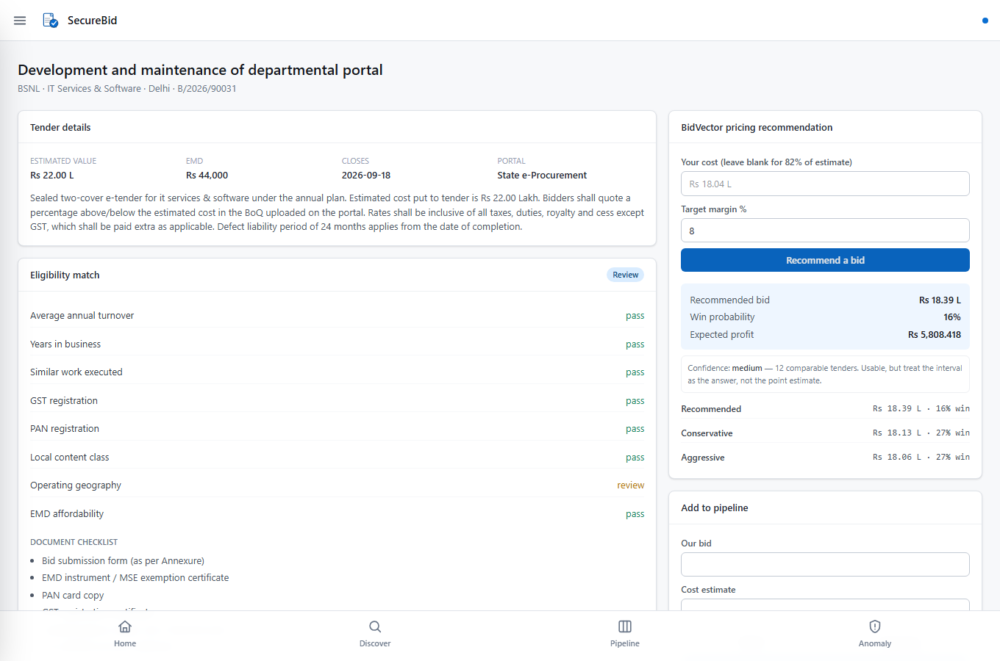

This is where the app's core differentiator lives. Opening a tender shows:

- **Tender details** — the raw facts (value, EMD, closing date, portal, description).
- **Eligibility match** — every criterion parsed from the tender's
  eligibility clauses, checked against your company profile, with a
  pass/review/fail verdict per line and a generated **document checklist**
  of what you'd need to submit.
- **Comparable history** — how similar tenders from the same buyer/category
  bucket were actually won in the past.
- **BidVector pricing recommendation** — enter your own cost estimate (or
  leave it blank to default to 82% of the tender's estimated value) and a
  target margin, then tap **Recommend a bid**. You get back:
  - A single **recommended bid**, its **win probability**, and **expected
    profit** — the bid that maximises expected profit given how rivals have
    historically bid in this buyer/category bucket.
  - A **confidence** label (low/medium/high) telling you how much
    historical data that estimate actually rests on — treat a "low
    confidence" number as a much rougher guide than a "high confidence" one.
  - Three named strategies side by side — **Conservative** (priced for
    margin, wins roughly 1 in 4), **Recommended** (the profit-maximising
    bid), and **Aggressive** (priced to win, roughly 70% win rate) — so the
    trade-off between margin and throughput is a visible choice, not a
    single hidden number.
- **Add to pipeline** — enter your actual bid and cost estimate and tap
  **Watch**, **Preparing**, or **Mark submitted** to add this tender to
  your pipeline at that stage.

### 4.4 Pipeline

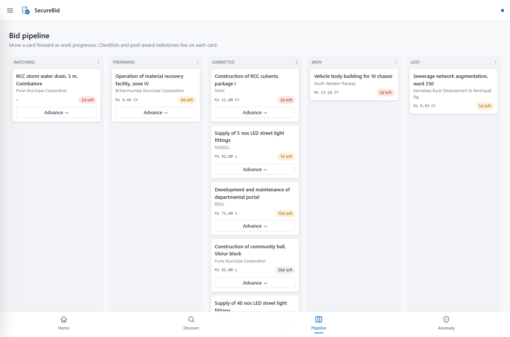

A Kanban board across five columns: **Watching → Preparing → Submitted →
Won / Lost**. Tap **Advance →** on a card to move it to the next stage.
Tap a card itself to expand it:

- Cards in **Preparing** or **Submitted** show a **prep checklist** — tick
  items off, or type into the box at the bottom and tap **Add** for a new
  one.
- Cards in **Won** show **post-award milestones** instead (mobilisation,
  first billing, EMD refund, etc.) — tick them off as they're completed.

You don't need to move a card to "Won" or "Lost" yourself if the Tender
Caller awards that tender through the app (§5.3) — it happens automatically
the moment they pick a winner, and your board updates to match.

### 4.5 Anomaly (Collusion Screens) — one of your four bottom-bar features

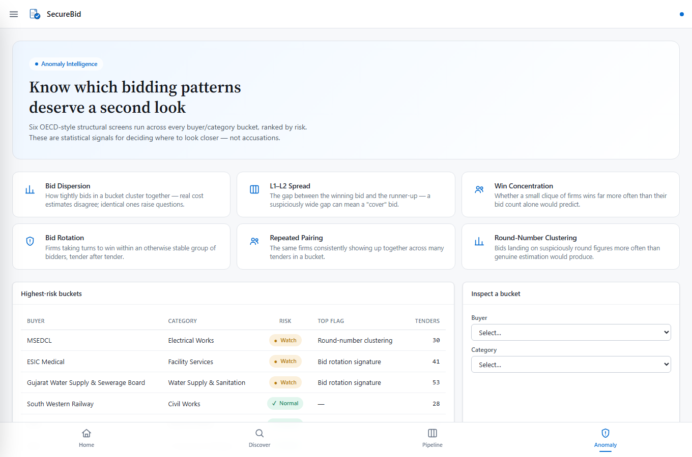

This sits on the bottom bar deliberately, alongside Home, Discover and
Pipeline, because it's the app's other core differentiator: six OECD-style
structural screens for bid-rigging patterns, run across every buyer/category
bucket and ranked by risk.

- **Bid Dispersion** — how tightly bids in a bucket cluster together; real
  independent cost estimates disagree, so identical ones raise questions.
- **L1–L2 Spread** — the gap between the winning bid and the runner-up; a
  suspiciously wide gap can mean a deliberately uncompetitive "cover" bid.
- **Win Concentration** — whether a small clique of firms wins far more
  often than their bid count alone would predict.
- **Bid Rotation** — firms taking turns to win within an otherwise stable
  group of bidders, tender after tender.
- **Repeated Pairing** — the same firms consistently showing up together
  across many tenders in a bucket.
- **Round-Number Clustering** — bids landing on suspiciously round figures
  more often than genuine estimation would produce.

Tap a row in **Highest-risk buckets** (or pick a buyer and category
yourself under **Inspect a bucket**) to see the full detail behind a risk
label — every flag shows its plain-language meaning, not just a score.
Risk levels are shown as **Elevated / Watch / Normal**, deliberately never
"corrupt" or "clean" — these are statistical screens meant to guide where
to look closer, not accusations, and every screen carries that caveat.

### 4.6 Portfolio (in the menu)

Given your working capital and a maximum number of concurrent bids, this
runs an EMD-constrained optimiser across every open, eligible, profitable
tender and tells you which combination of bids maximises total expected
profit without exceeding your capital. It also shows the **shadow price**
of capital — roughly, how much extra expected profit one more lakh of
working capital would buy you right now.

### 4.7 Analytics (in the menu)

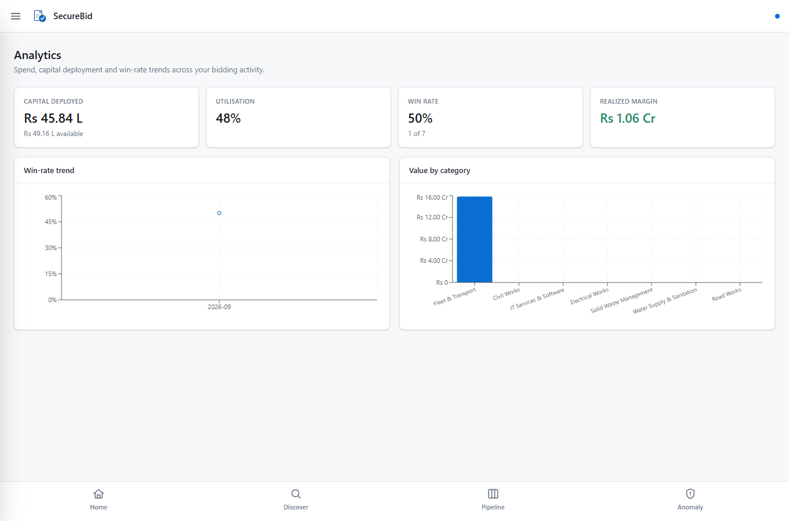

Aggregate view of your own bidding activity: capital deployed vs.
available, a win-rate trend over time, and total value by category — built
from your pipeline history as it accumulates. This page is thin until
you've made a few real decisions (won/lost some tenders); a fresh account
won't have much to show here yet, by design rather than by bug.

### 4.8 Competitors (in the menu)

Look up who else bids in a given buyer/category bucket, how often they win,
and how aggressively they price. Tap a firm's name to see their detailed
bidding history and win rate across categories.

### 4.9 Eligibility Parser (in the menu)

Paste any tender's raw eligibility clause text and see exactly what the
parser extracts — turnover threshold, experience requirement, similar-work
value, required certifications, local-content class, MSME relaxations, and
joint-venture rules — plus whether your own profile currently meets it.
Useful for sanity-checking a tender you found outside SecureBid, or for
understanding why the app scored a real tender the way it did.

### 4.10 Alerts & Saved Searches (in the menu)

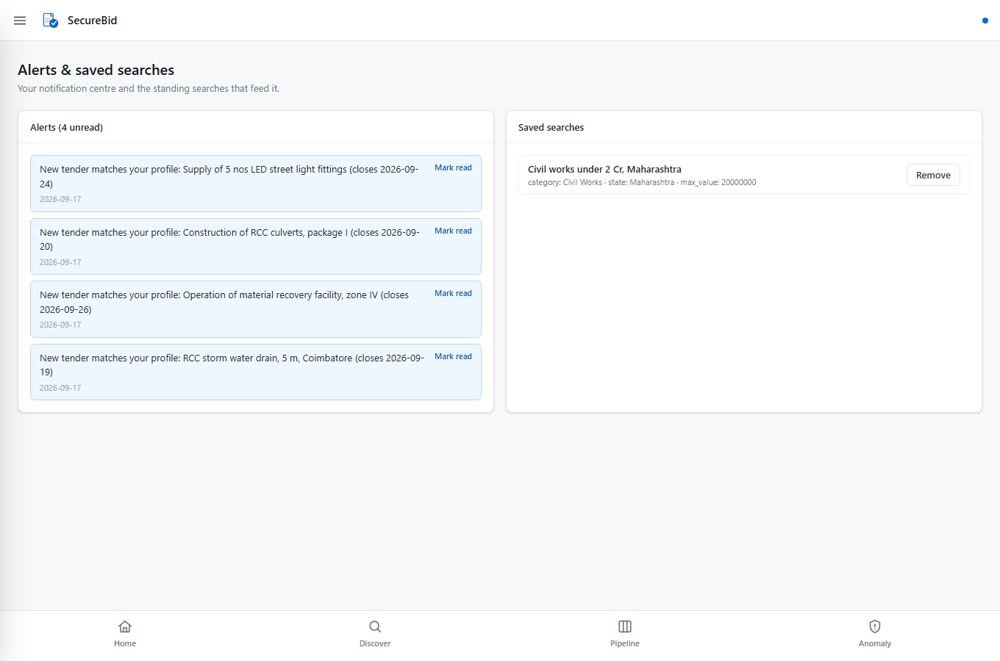

Your notification centre. **Alerts** lists system messages (e.g. "new
tender matches your profile") — tap **Mark read** to dismiss one. **Saved
searches** lists every search you saved from Discover — remove one with the
button on its row.

### 4.11 Company Profile (in the menu)

Everything here feeds the eligibility checker and the capital model used by
Portfolio and the pricing engine's cost-ratio default: Udyam registration,
MSME/bidder class, turnover, experience, largest similar work completed,
certifications, states and categories you operate in, working capital,
overhead %, and target margin %. Keep it accurate — a stale profile means
inaccurate eligibility screening and pricing recommendations.

---

## 5. For Tender Callers (buyer / procuring entity)

### 5.1 My Tenders

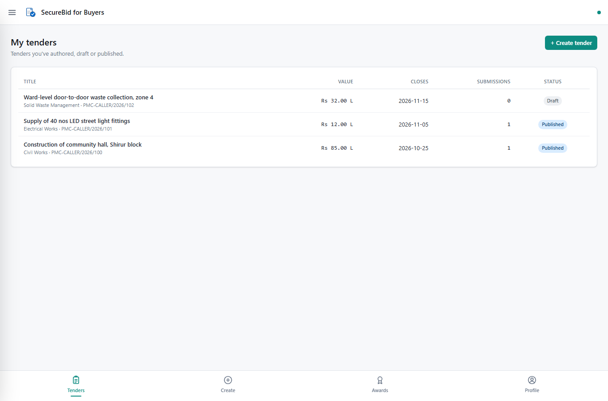

Every tender you've authored, with its status (**Draft**, **Published**, or
**Closed**) and how many bids it's received so far. Tap **+ Create tender**
to start a new one, or tap any row to open it.

### 5.2 Create Tender

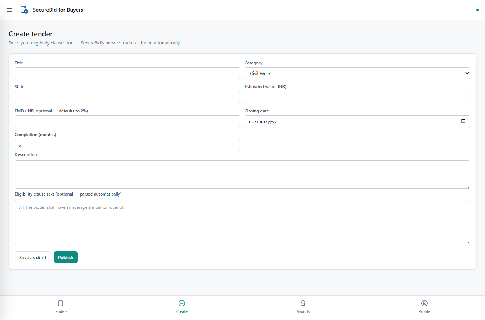

Fill in the title, category, state, estimated value, EMD (leave blank to
default to 2% of value), closing date, and a description. If you paste
eligibility clause text into the last field, SecureBid runs the same parser
bidders see, automatically structuring your criteria — you don't have to
fill that in by hand. Tap **Save as draft** to keep working on it later
(bidders can't see it yet), or **Publish** to make it live immediately.

### 5.3 Evaluating submissions

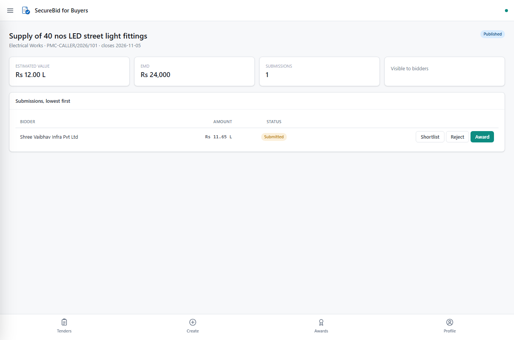

Open any published tender to see every bid submitted against it, sorted
lowest-first. For each submission (while the tender is still open) you can:

- **Shortlist** or **Reject** it, to organise your evaluation, or
- **Award** it — this picks that bid as the winner.

### 5.4 Awarding a tender

Tapping **Award** on a submission closes the tender and, in one atomic
step that either completes fully or not at all:

- Records the award and every bid in the historical data that the
  bidder-side pricing engine, competitor intelligence, and collusion
  screens all learn from — your real activity makes those tools smarter
  over time, not just the seeded demo data.
- Flips the winning submission to **won** and every other submission on
  that tender to **lost**.
- Updates each bidder's own pipeline board to match, automatically — they
  don't have to do anything.

A tender can only be awarded once; trying again after it's closed is
rejected outright rather than silently creating a duplicate award.

### 5.5 Awards

A simple list of every tender you've closed with an award, for quick
reference.

### 5.6 Profile

Your department, state and designation, shown to bidders on the tenders you
publish.

---

## 6. For Government Officials

This role is **read-only** — no bidding, no publishing tenders. It exists
purely for cross-department oversight, and it's the portal where the
anomaly-detection system is most fully expressed.

### 6.1 Overview

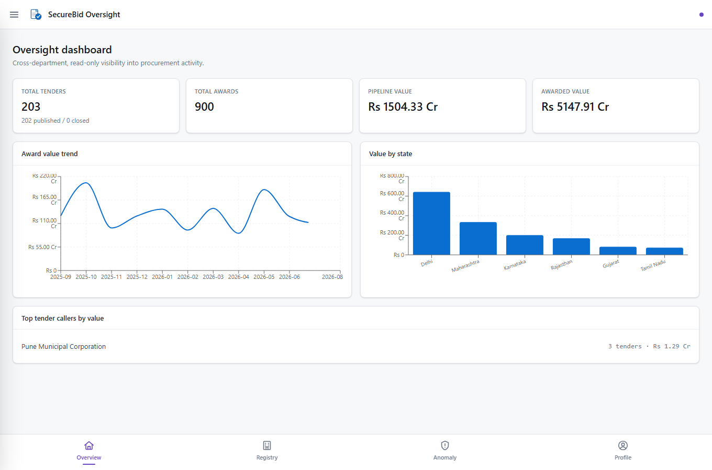

System-wide totals (tenders, awards, pipeline value, awarded value), an
award-value trend over time, spend broken down by state, and a ranking of
the tender-calling organisations by total value published.

### 6.2 Anomaly — one of your four bottom-bar features

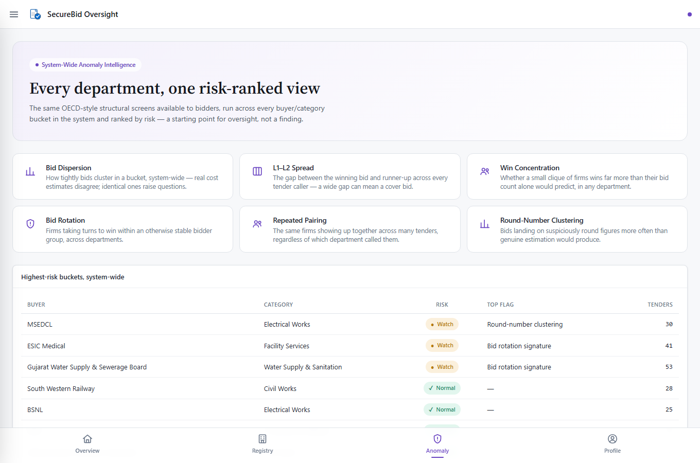

The same six OECD-style structural screens available to bidders (§4.5), but
run across **every** buyer/category bucket in the system, from every
tender caller, and ranked by risk — a starting point for oversight, never
a finding on its own. This is the page a "smart governance / automated
procurement anomaly detection" workflow is actually about: surfacing which
combinations of buyer and category deserve a closer look, explaining why
via the six named screens, and deliberately stopping short of ever labelling
a vendor "corrupt."

### 6.3 Registry

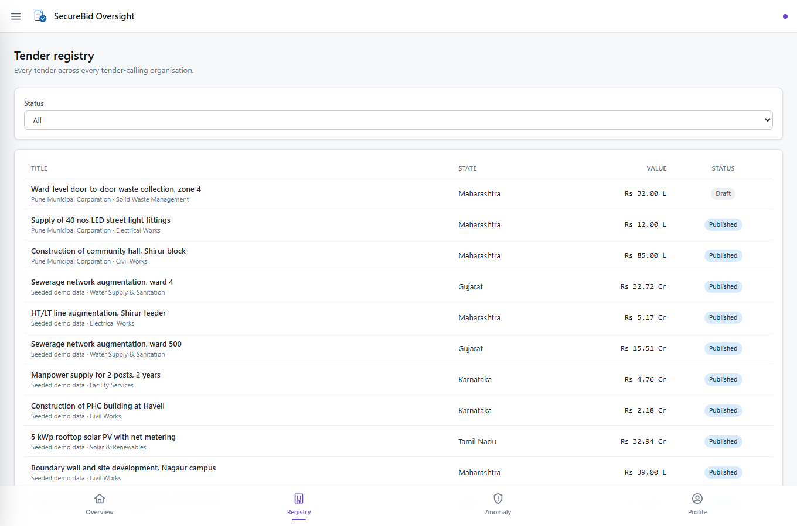

Every tender in the system, from every tender caller, filterable by status.
Unlike a bidder's Discover page, this includes drafts and closed tenders
too — nothing is hidden from this view.

### 6.4 Profile

Your department, jurisdiction and designation.

---

## 7. Account & security

A few things worth knowing about how SecureBid protects an account, since
they change what you should expect when something seems to "log you out
unexpectedly":

- **Single active session.** Only one sign-in is valid per account at a
  time (§2.5). This is intentional, not a bug — it means a stolen or
  forgotten-open session gets silently replaced the moment the real owner
  signs in again elsewhere.
- **Real server-side sign-out.** Signing out invalidates your session token
  on the server immediately (§2.8), not just locally in your browser.
- **Password resets revoke everything.** Resetting your password also
  signs out every other active session on that account, on the assumption
  that a password reset often follows a compromise.
- **Google sign-in is verified, not trusted blindly.** When you use
  "Continue with Google," SecureBid verifies the credential directly
  against Google's own servers before creating a session — it never simply
  trusts whatever the browser sends.

---

## 8. Glossary

A few Indian public-procurement terms used throughout the app, for anyone
new to this domain:

- **EMD (Earnest Money Deposit)** — a refundable deposit a bidder puts down
  to bid on a tender, forfeited if they win and then back out. This is why
  "capital locked up in EMD" matters — it's real money committed while a
  bid is pending.
- **L1** — shorthand for the lowest bid in a tender (the usual winner in a
  price-only evaluation). "L1 ratio" means the winning bid as a fraction of
  the estimated value.
- **MSME / Udyam** — Micro, Small & Medium Enterprises and their government
  registration scheme; MSME-registered bidders often get relaxed turnover
  thresholds or EMD exemptions, which the eligibility parser accounts for.
- **Bidder class (Class I / Class II)** — local-content classification
  under the Make in India procurement order; some tenders restrict
  eligibility to a particular class or better.
- **Cover bidding** — a collusion pattern where several bidders submit
  deliberately uncompetitive "cover" bids so a pre-agreed member wins; this
  is what the collusion/anomaly screens are designed to surface signs of.

---

## 9. Troubleshooting (running it yourself)

- **"No such endpoint" or a blank page after login** — make sure the
  frontend was built (`npm run build` inside `frontend/`) before starting
  `python run.py`; the backend serves the built files and won't have
  anything to serve otherwise. See the main `README.md`.
- **No "Continue with Google" button appears** — this feature needs a real
  Google OAuth 2.0 Web Client ID. In Google Cloud Console, go to
  **APIs & Services → Credentials → Create Credentials → OAuth client ID**,
  choose **Web application**, and add this app's URL (e.g.
  `http://localhost:8000`) as an **Authorized JavaScript origin**. Then set
  `GOOGLE_CLIENT_ID` in the server's environment to that client ID and
  restart. No client secret is needed for this flow. Without it configured,
  the button is simply hidden — email/password sign-in always works.
- **Verification/reset email never arrives** — if `SMTP_HOST` isn't
  configured, SecureBid logs the email content (including the link) to the
  server's console instead of sending it. Check there.
- **Want a clean demo dataset again** — run `python run.py --reseed`. This
  wipes the database and regenerates the synthetic demo corpus, including
  the three demo accounts above.
